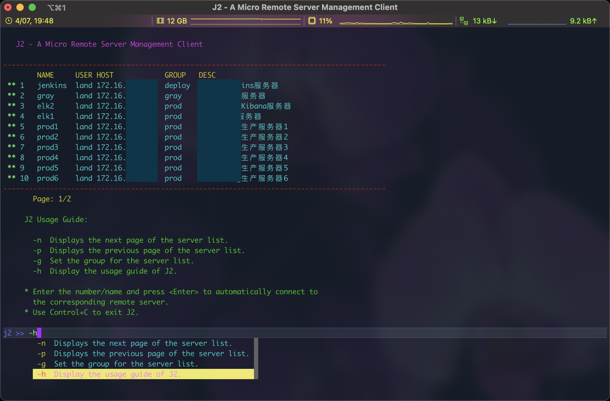

# J2 - A micro remote server management client. #

[](https://github.com/edoger/j2)

## Installation ##

- Use ``` go get -u github.com/edoger/j2/cmd ```
- Download the compiled binary file from the [release page](https://github.com/edoger/j2/releases).

## License ##

[Apache-2.0](http://www.apache.org/licenses/LICENSE-2.0)
